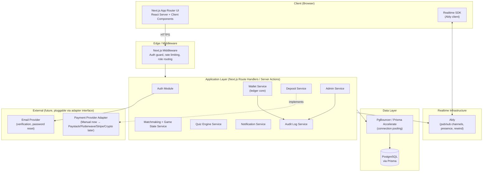
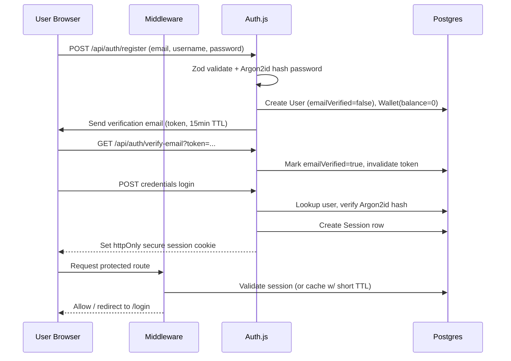
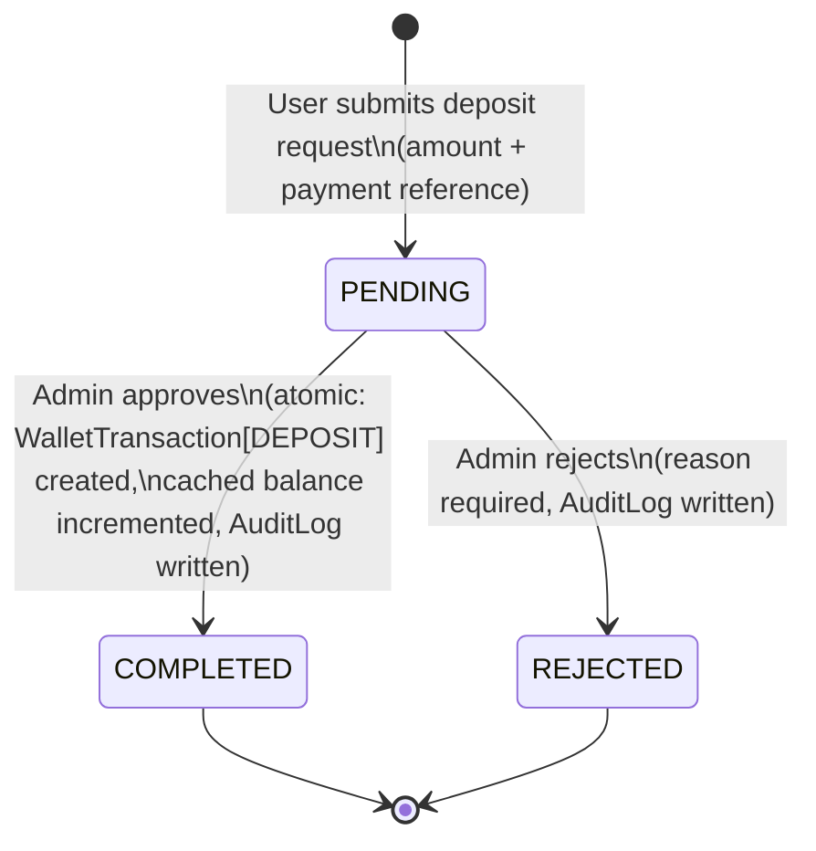
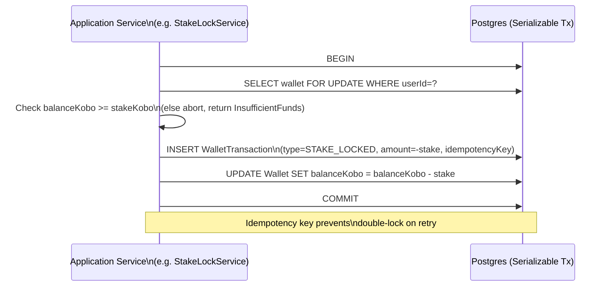
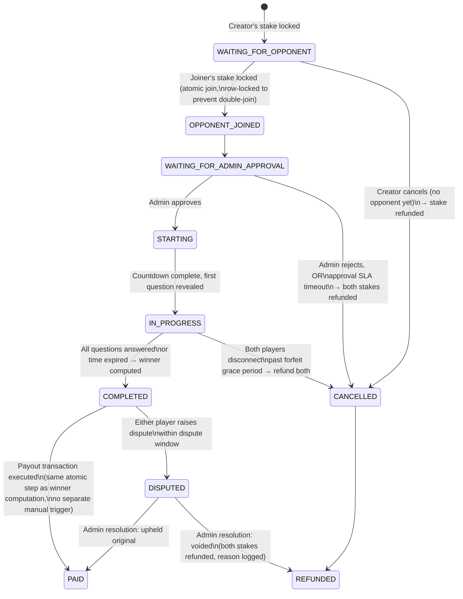
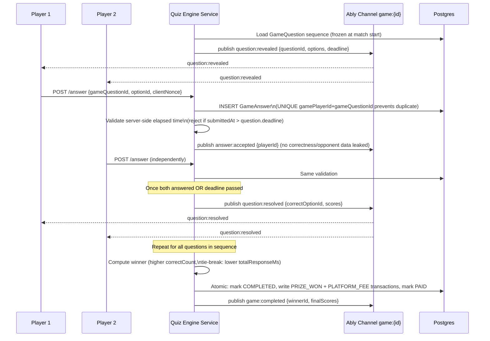
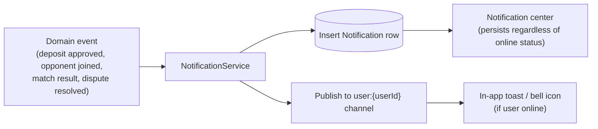

# Wav Workshop Game Center — Phase 1: Architecture & Planning

**Status:** Draft for review. No implementation code has been written. This document is the complete Phase 1 deliverable — read it, resolve the open questions at the bottom, and approve before Phase 2 (implementation) begins.

**Confirmed scope constraints going in:**
- Visual reference is the 10 provided screenshots only (no source HTML/CSS bundle was present in the working directory). Pixel-perfect fidelity to an unseen prototype is not achievable — implementation will match the screenshots closely (layout, spacing, color, copy) and flag anywhere it has to infer a state that wasn't captured (e.g. error states, empty states, mobile breakpoints).
- Target posture: **Nigeria, MVP/informal stage.** No gambling license assumed yet, all money movement is manually verified by an admin, and the architecture must let real payment rails (Paystack/Flutterwave/Stripe/crypto) and formal compliance (KYC, licensing) slot in later without a rewrite.

---

## 1. Critical Analysis — Challenging the Idea

This section is deliberately adversarial, per your instructions. Nothing here is a rejection of the concept — it's the list a regulator, a fraud analyst, or an on-call engineer would hand you before launch.

### 1.1 Business model risk
- **This is real-money player-vs-player wagering.** Calling it "skill-based" does not automatically exempt it from Nigeria's gaming regulations. The National Lottery Regulatory Commission (NLRC) and state-level gaming boards (e.g. Lagos State Lotteries Board) regulate wagering products, and "skill-based" is not a settled safe harbor in Nigerian law the way it is in some US states. **Recommendation:** treat this as a legal question to route to actual counsel before real money moves at any real volume — the architecture below is designed so licensing/KYC can be bolted on, but I cannot and should not make the legal call for you. Logged as a top risk in §7.
- **No responsible-gambling controls are in the current spec** — no deposit limits, no loss limits, no self-exclusion, no age verification. Even at MVP scale this is the single highest-risk gap if anything goes wrong (a minor plays, someone loses rent money, etc.). Recommendation: add a `minAge` gate at registration (self-attested for MVP, KYC-verified later) and an optional per-user daily-loss soft cap in `Settings`, even if not enforced strictly at first.
- **The platform is a counterparty to every match**, not just a matchmaker — it holds staked funds in escrow between "stake locked" and "prize paid." That makes the Wallet ledger the single most important subsystem in the whole app; a bug there is a direct financial-loss bug, not a UX bug. Designed accordingly in §3.3.

### 1.2 Missing business rules (need your decision — full list in §9)
The screenshots and prompt imply several rules that are never stated explicitly:
- **Tie-break rule.** If both players answer the same number of questions correctly, who wins? Screenshots show a single "Winner Receives / Loser Refund" split with no draw state.
- **Disconnect / forfeit rule.** What happens if a player closes the tab mid-match? Auto-forfeit after a grace period, or pause-and-resume?
- **Admin-approval SLA.** "Waiting for Admin Approval" is a real game state with real money locked behind it. If no admin acts, funds sit locked indefinitely. Needs a timeout.
- **Stake tiers vs. free amount.** Screenshots show fixed buttons (₦500 / ₦1,000 / ₦2,500 / ₦5,000). Is a custom amount ever allowed?
- **Question count.** Screenshot shows "10" as a selected/default value under "Question Count" — is this configurable per match or fixed platform-wide?
- **One active lobby per user, or many?** Nothing stops a user from creating five "Waiting for Opponent" lobbies with money they don't have five times over, unless the wallet reserves stake at *creation* time, not at match-start time.
- **Same-person collusion.** Two accounts controlled by the same person could farm the "loser refund" (get 100 back on a 1,000 stake, or worse, deliberately throw matches to move money between two accounts they own if the fee is low enough). Needs a rule — flag by shared device/IP fingerprint, or don't launch that as friction at MVP?

### 1.3 Scalability considerations
- **Admin-approval-gated matches will not scale past a fairly small user base** unless there are multiple admins with a real queue/dashboard (which the screenshots do show — "Operations Overview" — good sign this was anticipated). Still worth stating: at meaningful volume, manual match approval becomes the bottleneck long before the database does. The state machine is designed so this gate can later be replaced by automated risk-scoring without changing match semantics.
- **Real-time quiz sync is the actual scaling risk**, not CRUD traffic. Every simultaneous match needs a synchronized countdown and low-latency answer submission for two players. This has to be designed for horizontal scale from day one (stateless app servers + externalized pub/sub), covered in §3.5.
- **Serverless Next.js (implied by the stack) cannot hold a persistent Postgres connection per request** at scale — without connection pooling (PgBouncer / Prisma Accelerate), you will exhaust Postgres connections well before you exhaust the app tier. Called out as a required infra decision, not optional, in §6.

### 1.4 Security concerns specific to this domain
- Money + quiz answers + real-time channels = **three separate attack surfaces that all need independent anti-cheat/anti-fraud treatment**: (a) can a user forge a wallet transaction, (b) can a user see or alter quiz answers/timing, (c) can a user intercept or replay the real-time channel to see their opponent's answers first. All three are addressed explicitly in §6 and §3.5 — none of them are solved just by "add authentication."
- Admin actions (approve deposit, adjust balance, override a match result) are **the highest-value target in the system** — a compromised admin account is a direct path to unlimited free money. This is why §2.2 pushes back on treating Admin as a lightly-protected afterthought.

### 1.5 What I'm *not* second-guessing
The overall shape — two roles, ledger-based wallet, admin-gated MVP with a path to automated payments, head-to-head quiz matches, Next.js/Prisma/Postgres stack — is sound and is what I'd build. The pushback above is about the gaps, not the direction.

---

## 2. Recommended Architecture

### 2.1 System overview



**Architectural style:** Modular monolith inside Next.js, not microservices. At this scale (single product, one team) microservices would add operational overhead without a corresponding benefit — the modularity you actually need (business logic isolation, testability, swappable payment backend) is achieved with **Clean Architecture layering inside one deployable**, not with network boundaries. Revisit only if a specific module (e.g. the quiz engine) genuinely needs independent scaling.

**Layering per module** (Clean Architecture / dependency inversion):
```
domain/        → entities, value objects, business rules (framework-agnostic, no Prisma imports)
application/   → use-cases / services that orchestrate domain rules (e.g. "approveDeposit")
infrastructure/→ Prisma repositories, Ably publisher, email sender — implements interfaces defined in domain
interface/     → Next.js route handlers / server actions — thin, call application services only
```
This is what makes the payment-provider swap possible: `DepositService` depends on a `PaymentVerificationPort` interface. `ManualAdminVerification` implements it today; `PaystackAdapter` implements the same interface later. Nothing in `application/` or `domain/` changes.

### 2.2 Pushback: unify User and Admin into one table with a role enum

The prompt asks for separate `User` and `Admin` Prisma models. I'd recommend against that, and here's the concrete reasoning — flagging it as a "recommend better architecture where necessary" moment rather than silently complying:

- Separate tables mean **two parallel auth systems** (two password fields, two session flows, two "who is logged in" checks scattered through the code) — this directly violates your own stated rule that "business rules should exist in only one place."
- It also can't cleanly express a support engineer who is *also* a player (unlikely today, plausible later), and it complicates the audit log's `actorId` foreign key (now needs to point at two possible tables).

**Recommendation:** one `User` table with `role: USER | ADMIN` (enum, extensible to `SUPER_ADMIN` later), plus an optional `AdminProfile` side-table holding admin-only fields (TOTP secret, IP allowlist, permission scopes) so the base `User`/`Wallet`/auth model stays identical for everyone. Route protection and UI still branch cleanly on `role`. If you have a strong reason to keep them fully separate (e.g. admins will live in a totally different identity system later, like SSO), tell me and I'll flip this back — otherwise this is what gets built.

### 2.3 Authentication strategy

**Recommendation: Auth.js (NextAuth) v5 with the Credentials provider, database session strategy, Prisma adapter.**

Why database sessions over JWT sessions, specifically for this app: an admin needs to be able to **suspend or ban a user and have it take effect immediately.** JWT sessions are stateless and valid until expiry regardless of what the database says — you'd need a separate revocation blocklist to fake immediate revocation, which is more moving parts than just using database sessions, where deleting the session row *is* the revocation. Given this app's financial-abuse surface, immediate revocation is worth the extra DB read per request.

- **Password hashing: Argon2id**, not bcrypt. OWASP's current recommendation for new systems is Argon2id first, bcrypt only as a fallback where Argon2 isn't available. It's memory-hard, which matters more here than the marginal simplicity of bcrypt, given the financial stakes of a credential-stuffing win.
- **Cookies:** `httpOnly`, `secure`, `sameSite=lax` session cookie. `lax` (not `strict`) so a user clicking a deposit-confirmation email link doesn't get logged out mid-flow.
- **CSRF:** Server Actions get Next.js's built-in Origin-header verification for free. Traditional API route handlers used for webhooks/external calls get explicit Origin/Referer checks since they don't get that protection automatically.
- **Admin accounts:** same table/session mechanism as above, but require TOTP 2FA before the admin can perform *money-moving* actions (approve deposit, adjust balance, override result) — even if 2FA is optional for regular users at MVP. This is the one piece of "future-ready" 2FA I'd pull into MVP scope given admins have direct balance-adjustment power; open question in §9 if you'd rather defer it.
- **Email verification / password reset:** token-based, single-use, short-TTL (15 min) tokens stored hashed in a `VerificationToken` table (the standard Auth.js table), delivered via a pluggable `EmailSender` interface so swapping Resend/SendGrid/SES later doesn't touch business logic.

### 2.4 Database design

```mermaid
erDiagram
    USER ||--o| ADMIN_PROFILE : "has (if role=ADMIN)"
    USER ||--|| WALLET : owns
    WALLET ||--o{ WALLET_TRANSACTION : records
    USER ||--o{ DEPOSIT : requests
    DEPOSIT ||--o| WALLET_TRANSACTION : "settles into"
    USER ||--o{ GAME_PLAYER : plays
    GAME ||--o{ GAME_PLAYER : has
    GAME }o--|| CATEGORY : "belongs to"
    GAME ||--o{ GAME_QUESTION : contains
    QUESTION ||--o{ GAME_QUESTION : "used in"
    QUESTION }o--|| CATEGORY : "belongs to"
    QUESTION ||--o{ QUESTION_OPTION : has
    GAME_PLAYER ||--o{ GAME_ANSWER : submits
    GAME_QUESTION ||--o{ GAME_ANSWER : "answered via"
    GAME ||--o| DISPUTE : "may have"
    USER ||--o{ NOTIFICATION : receives
    USER ||--o{ AUDIT_LOG : "acts as actor"
    GAME ||--o{ WALLET_TRANSACTION : "generates (stake/prize/fee)"
    ADMIN_PROFILE ||--o{ AUDIT_LOG : "performs (as admin)"

    USER {
        uuid id PK
        string email UK
        string passwordHash
        string username UK
        enum role "USER | ADMIN"
        enum status "ACTIVE | SUSPENDED | BANNED"
        boolean emailVerified
        datetime createdAt
    }
    ADMIN_PROFILE {
        uuid id PK
        uuid userId FK
        string totpSecret
        boolean twoFactorEnabled
        string[] permissionScopes
    }
    WALLET {
        uuid id PK
        uuid userId FK
        bigint balanceKobo "cached, derived from transactions"
        datetime updatedAt
    }
    WALLET_TRANSACTION {
        uuid id PK
        uuid walletId FK
        enum type "DEPOSIT | DEPOSIT_REJECTED | STAKE_LOCKED | STAKE_REFUNDED | PRIZE_WON | PLATFORM_FEE | MANUAL_ADJUSTMENT"
        bigint amountKobo "signed: + credit, - debit"
        bigint balanceAfterKobo
        uuid relatedGameId FK "nullable"
        uuid relatedDepositId FK "nullable"
        string idempotencyKey UK
        string createdByAdminId FK "nullable, for manual adjustments"
        string reason "nullable, required for manual adjustments"
        datetime createdAt
    }
    DEPOSIT {
        uuid id PK
        uuid userId FK
        bigint amountKobo
        string paymentReference
        enum status "PENDING | COMPLETED | REJECTED"
        uuid reviewedByAdminId FK "nullable"
        string rejectionReason "nullable"
        datetime createdAt
        datetime reviewedAt
    }
    CATEGORY {
        uuid id PK
        string name UK
        string icon
        boolean active
    }
    QUESTION {
        uuid id PK
        uuid categoryId FK
        string topic
        enum difficulty "EASY | MEDIUM | HARD"
        text prompt
        text explanation
        string[] tags
        boolean active
        datetime createdAt
    }
    QUESTION_OPTION {
        uuid id PK
        uuid questionId FK
        string label
        boolean isCorrect
        int sortOrder
    }
    GAME {
        uuid id PK
        uuid categoryId FK
        uuid createdByUserId FK
        bigint stakeKobo
        int questionCount
        enum status "WAITING_FOR_OPPONENT | OPPONENT_JOINED | WAITING_FOR_ADMIN_APPROVAL | STARTING | IN_PROGRESS | COMPLETED | PAID | CANCELLED | REFUNDED | DISPUTED"
        uuid winnerUserId FK "nullable"
        uuid approvedByAdminId FK "nullable"
        datetime approvalDeadline "nullable"
        datetime createdAt
        datetime startedAt
        datetime completedAt
    }
    GAME_PLAYER {
        uuid id PK
        uuid gameId FK
        uuid userId FK
        int score
        int correctCount
        int totalResponseMs
        boolean forfeited
        datetime joinedAt
    }
    GAME_QUESTION {
        uuid id PK
        uuid gameId FK
        uuid questionId FK
        int sequence
        datetime revealedAt "nullable"
    }
    GAME_ANSWER {
        uuid id PK
        uuid gamePlayerId FK
        uuid gameQuestionId FK
        uuid selectedOptionId FK "nullable (timeout = null)"
        boolean isCorrect
        int responseMs
        string clientNonce "anti-replay, unique per submission"
        datetime submittedAt
    }
    DISPUTE {
        uuid id PK
        uuid gameId FK
        uuid raisedByUserId FK
        text reason
        enum status "OPEN | RESOLVED"
        uuid resolvedByAdminId FK "nullable"
        text resolutionReason "nullable"
        enum resolution "UPHELD_ORIGINAL | OVERTURNED | VOIDED_REFUNDED"
        datetime createdAt
        datetime resolvedAt
    }
    NOTIFICATION {
        uuid id PK
        uuid userId FK
        string type
        string title
        text body
        boolean read
        datetime createdAt
    }
    AUDIT_LOG {
        uuid id PK
        uuid actorUserId FK "admin who acted"
        string action
        string targetType
        uuid targetId
        json beforeState
        json afterState
        text reason "nullable, required for financial/override actions"
        string ipAddress
        datetime createdAt
    }
    PLATFORM_REVENUE {
        uuid id PK
        uuid gameId FK
        bigint amountKobo
        datetime createdAt
    }
    SETTINGS {
        uuid id PK
        string key UK
        string value
        string description
    }
```



**Key design decisions embedded in this schema:**
- **Money is `bigint` kobo (smallest currency unit), never a float.** All amounts are integers; a ₦1,000 stake is `100000`. This eliminates an entire class of rounding bugs.
- **`WalletTransaction.idempotencyKey` is unique** — every mutating financial operation (deposit approval, stake lock, prize payout) is issued a deterministic key derived from its trigger (e.g. `game:{id}:stake:{userId}`) so retries (network blips, double-clicks, webhook redelivery later) can never double-charge or double-pay. This is what "idempotent operations" means concretely, not just a checkbox.
- **`Wallet.balanceKobo` is a cached, derived value**, not the source of truth — it's written *only* inside the same DB transaction that inserts the `WalletTransaction` row (`SELECT ... FOR UPDATE` on the wallet row, then insert transaction, then update cached balance, single Prisma `$transaction` at `Serializable` isolation). A nightly reconciliation job recomputes `SUM(walletTransactions.amountKobo)` per wallet and pages someone if it ever drifts from the cached value. This gets you ledger-correctness *and* fast reads.
- **Partial double-entry via `PlatformRevenue`:** the platform-fee leg of every completed game is recorded both as a negative `PLATFORM_FEE` transaction against the winner's wallet-adjacent flow and as a positive row in `PlatformRevenue` tied to the same `gameId` — so platform earnings are auditable against individual games, not just a floating aggregate.
- **`GameAnswer.clientNonce`** plus a server-side `UNIQUE(gamePlayerId, gameQuestionId)` constraint is the concrete anti-replay/anti-duplicate-submission mechanism — a second submission for the same question from the same player is rejected at the DB constraint level, not just in application logic.
- **`Question`/`QuestionOption` model your own bank** (see §2.6) rather than being denormalized into `Game` — this lets a question be reused across many games while `GameQuestion` freezes *which* questions were in *this specific* game, in order, for fairness auditing.

### 2.5 API structure

REST-ish route handlers under `app/api/**`, grouped by domain, plus Server Actions for form-backed mutations (deposits, match creation) where progressive enhancement and built-in CSRF protection are valuable. Every handler: Zod-validates input → calls one `application/` service → returns typed JSON. No business logic in the handler itself.

| Group | Endpoint | Method | Notes |
|---|---|---|---|
| **Auth** | `/api/auth/register` | POST | Rate-limited, email verification token issued |
| | `/api/auth/[...nextauth]` | * | Auth.js handler (login/logout/session) |
| | `/api/auth/verify-email` | POST | Consumes verification token |
| | `/api/auth/forgot-password` / `reset-password` | POST | Token-based, rate-limited |
| **Wallet** | `/api/wallet` | GET | Current balance |
| | `/api/wallet/transactions` | GET | Paginated ledger history |
| **Deposits** | `/api/deposits` | POST | User creates deposit request |
| | `/api/deposits/:id` | GET | Status of one deposit |
| | `/api/admin/deposits` | GET | Admin queue, filter by status |
| | `/api/admin/deposits/:id/approve` | POST | Admin only, 2FA-gated, writes AuditLog |
| | `/api/admin/deposits/:id/reject` | POST | Admin only, requires reason |
| **Games** | `/api/games` | GET | Browse active/open lobbies, filter by category |
| | `/api/games` | POST | Create match (locks creator's stake) |
| | `/api/games/:id/join` | POST | Join open lobby (locks joiner's stake, atomic) |
| | `/api/games/:id` | GET | Match detail/state |
| | `/api/admin/games/pending-approval` | GET | Admin queue |
| | `/api/admin/games/:id/approve` | POST | Admin only, validates balances again server-side |
| | `/api/admin/games/:id/cancel` | POST | Admin only, triggers refund |
| **Quiz (in-match)** | `/api/games/:id/answer` | POST | Submit answer, idempotent via clientNonce |
| | (realtime, not REST) | — | Countdown, question reveal, live score via Ably channel `game:{id}` |
| **Questions (admin CMS)** | `/api/admin/questions` | GET/POST | List/create |
| | `/api/admin/questions/:id` | PATCH/DELETE | Edit/retire (soft delete via `active=false`) |
| | `/api/admin/categories` | GET/POST | Category management |
| **Users** | `/api/users/me` | GET/PATCH | Profile |
| | `/api/users/me/stats` | GET | Win rate, rank, match history |
| | `/api/leaderboard` | GET | Season-scoped ranking |
| | `/api/admin/users` | GET | Search/list, includes wallet snapshot |
| | `/api/admin/users/:id/suspend` / `/ban` | POST | Requires reason, kills active sessions |
| | `/api/admin/users/:id/adjust-balance` | POST | Requires reason, writes `MANUAL_ADJUSTMENT` transaction |
| **Notifications** | `/api/notifications` | GET | List, paginated |
| | `/api/notifications/:id/read` | POST | Mark read |
| **Disputes** | `/api/games/:id/dispute` | POST | User raises dispute |
| | `/api/admin/disputes/:id/resolve` | POST | Admin only, requires reason + resolution |
| **Analytics** | `/api/admin/analytics/overview` | GET | Revenue today, matches today, users online, pending actions |
| | `/api/admin/analytics/revenue` | GET | Time-series platform earnings |
| **Admin/Settings** | `/api/admin/settings` | GET/PATCH | Platform config (fee %, stake tiers, approval SLA) |
| | `/api/admin/audit-log` | GET | Filterable, read-only |

### 2.6 Quiz question source — recommendation

**Build your own PostgreSQL question bank (the `Question`/`QuestionOption` models above), not a live dependency on Open Trivia DB / QuizAPI / RapidAPI.**

Reasoning specific to this product, not a generic "own your data" answer:
- **Liability.** Money changes hands based on which answer is "correct." A third-party API returning a wrong or disputed answer (open trivia datasets are crowd-sourced and do contain errors) becomes a direct financial dispute you have to eat, with no ability to fix the source data. Owning the bank means you control correctness and can patch a bad question before it's ever served again.
- **Category fit.** Your screenshots show "Software Development" and "Cybersecurity" as categories — genuinely technical categories are not well covered by general trivia APIs (which skew pop-culture/geography/history). You'd end up hand-authoring the categories that matter most anyway.
- **Availability & rate limits.** A live match cannot stall because a third-party API is down or rate-limited mid-question-reveal. Self-hosted removes that failure mode entirely.
- **Fairness auditing.** `GameQuestion` freezes exactly which questions appeared in which match, in order — defensible in a dispute ("here's the exact question set, here's the timing"). That's much harder to guarantee against a live third-party feed that could theoretically change.

**Practical bootstrapping recommendation:** don't hand-author hundreds of questions before launch. Pull an initial technical question set from Open Trivia DB / curated open-source developer-quiz datasets as **one-time seed data**, run it through admin review (the CMS endpoints above already support edit/retire), and grow the bank organically after that. The dependency is a one-time import script, not a runtime dependency.

### 2.7 Real-time communication strategy — recommendation

Compared: WebSockets (raw), Socket.IO, Pusher, Ably, SSE.

| Option | Verdict |
|---|---|
| Raw WebSockets | Rejected — needs a persistent server process; incompatible with serverless Next.js route handlers without standing up and operating a separate socket server yourself, for no benefit over a managed option at this scale. |
| Socket.IO | Rejected for the same reason (needs a long-lived Node process) — viable only if you're already committed to a dedicated server instead of serverless deployment, which isn't the case here. |
| SSE | Rejected as primary channel — one-directional (server→client only), so answer submission still needs a separate HTTP path, and long-lived streaming connections are awkward on typical serverless function time limits. Fine as a lightweight fallback, not as the core transport. |
| Pusher | Viable, but weaker reconnection story for this specific requirement. |
| **Ably** | **Recommended.** |

**Why Ably specifically:** the prompt's own requirements — *live countdown, question sync, live score, reconnection, network-interruption recovery* — map almost one-to-one onto two Ably features: **channel rewind** (a reconnecting client can replay the last N messages on a channel, so a refreshed/reconnected player recovers the exact current question/countdown state instead of you hand-rolling a recovery protocol) and **presence channels** (know instantly when an opponent has disconnected, to drive the forfeit-timer business rule from §1.2). It's fully serverless-friendly: the Next.js server publishes events via Ably's REST API from within a route handler/service, clients subscribe via the Ably client SDK — no persistent server process to operate. Pusher can do the pub/sub basics but its history/replay depth is thinner, which pushes reconnection-recovery logic back into your own code instead of the platform's.

**Channel design:** one channel per match, `game:{gameId}`, carrying `question:revealed`, `countdown:tick`, `answer:accepted` (score update, not the correct answer), `player:reconnected`, `game:completed` events. A **separate** per-user channel `user:{userId}` carries notifications. The server is the only publisher of authoritative events (question reveal, correct/incorrect result); clients only ever *send* via the authenticated REST `answer` endpoint, never write directly to the channel — this is also the anti-cheat boundary (see §6).

---

## 3. Core Flows

### 3.1 Authentication flow



### 3.2 Deposit flow



Note the collapse from the prompt's original `Pending → Approved → Completed` into `Pending → Completed`: a separate "Approved-but-not-yet-Completed" state describes a moment where an admin has said yes but the wallet hasn't been credited yet — that's a race condition waiting to happen (what if the process crashes between those two steps?). Approval and crediting happen in one atomic DB transaction, so "Approved" and "Completed" are the same instant. If you specifically need an intermediate state for a future automated-payment-provider webhook flow (e.g. "provider confirmed, awaiting our reconciliation"), that's a different, provider-specific state I'd add back in when that adapter is built — not needed for the manual-admin flow today.

### 3.3 Wallet flow (ledger core)



Every wallet-affecting action (stake lock, stake refund, prize payout, platform fee, manual adjustment, deposit credit) goes through this exact pattern: row lock → validate → insert immutable transaction → update cached balance → commit, all inside one Prisma `$transaction`. No code path is ever allowed to `UPDATE Wallet SET balanceKobo = <literal>` directly — that's the "no direct balance editing" rule enforced structurally, not just by convention (recommend a DB-level check or a repository method that simply doesn't expose a raw setter).

### 3.4 Match flow — state machine



Illegal transitions are made structurally impossible, not just checked in an `if`: the application service exposes one method per legal transition (`approveMatch`, `startMatch`, `completeMatch`...), each takes the current row with a `WHERE status = <expected-current-state>` guard on its update — so a concurrent or out-of-order call simply updates zero rows and the service throws `InvalidStateTransition`, instead of silently corrupting state.

**Flagged gap requiring your decision (§9):** `COMPLETED → PAID` is drawn as automatic (winner computation and payout happen together) per "the system automatically determines the winner... admin should not normally decide winners." That means there is no manual "Payout" admin action in the common path — only the dispute path involves an admin. Confirm that's the intent, since it's a meaningful departure from "admin approves everything" being the MVP default elsewhere.

### 3.5 Quiz flow (real-time, in-match)



**Anti-cheat measures embedded here** (directly answering the prompt's anti-cheat list):
- *Timer manipulation / score manipulation:* the deadline and correctness are computed **server-side only**, from `GameQuestion.revealedAt` and `submittedAt` timestamps recorded by the server, never trusted from the client.
- *Replay / duplicate submissions:* `clientNonce` + the DB `UNIQUE(gamePlayerId, gameQuestionId)` constraint reject a second submission outright.
- *Answer modification / seeing opponent's answer first:* the correct option is never published on the `question:revealed` event, only on `question:resolved` after both players have answered or the deadline passed — so there's nothing in transit for a client to intercept and exploit.
- *Multiple sessions / suspicious behavior:* record `ipAddress` and a coarse device fingerprint on `GameAnswer`/`Session`; flag (not necessarily block) matches where both players share an IP/device for admin review — this is the concrete mechanism for the collusion concern from §1.2, pending your call on how aggressively to enforce it.
- *Browser refresh / network interruption abuse:* Ably rewind replays missed events on reconnect; the server is the sole source of truth for "what question are we on," so a refresh can't be used to get extra time — the deadline was already fixed server-side at reveal time.

### 3.6 Notification flow



Persistence-first: the `Notification` row is always written so the in-app notification center is complete even if the user was offline when it happened; the Ably publish is a best-effort real-time nudge on top, not the source of truth.

---

## 4. Folder Structure (feature-based, Clean Architecture)

```
game-center/
├── app/                              # Next.js App Router
│   ├── (public)/                     # login, register, landing
│   ├── (app)/                        # authenticated user shell
│   │   ├── dashboard/
│   │   ├── active-games/
│   │   ├── create-match/
│   │   ├── games/[id]/               # live match view
│   │   ├── categories/
│   │   ├── wallet/
│   │   ├── match-history/
│   │   ├── leaderboard/
│   │   ├── notifications/
│   │   ├── profile/
│   │   └── settings/
│   ├── (admin)/admin/
│   │   ├── overview/
│   │   ├── payments/
│   │   ├── matches/
│   │   ├── users/
│   │   ├── questions/
│   │   ├── revenue/
│   │   └── audit-log/
│   └── api/                          # route handlers, see §2.5
├── modules/                          # Clean Architecture core — framework-agnostic
│   ├── auth/{domain,application,infrastructure}/
│   ├── wallet/{domain,application,infrastructure}/
│   ├── deposits/{domain,application,infrastructure}/
│   ├── matchmaking/{domain,application,infrastructure}/
│   ├── quiz/{domain,application,infrastructure}/
│   ├── questions/{domain,application,infrastructure}/
│   ├── notifications/{domain,application,infrastructure}/
│   ├── admin/{domain,application,infrastructure}/
│   └── audit/{domain,application,infrastructure}/
├── components/
│   ├── ui/                           # shadcn/ui primitives
│   └── shared/                       # app-specific composed components
├── lib/
│   ├── prisma.ts
│   ├── ably.ts
│   ├── auth.ts                       # Auth.js config
│   ├── rate-limit.ts
│   └── validation/                   # shared Zod schemas
├── prisma/
│   ├── schema.prisma
│   └── seed.ts
├── tests/
│   ├── unit/
│   ├── integration/
│   └── e2e/                          # Playwright
└── docs/
```

`modules/*/domain` never imports from `app/`, `prisma/`, or any SDK — it's pure business rules and can be unit-tested with zero infrastructure. `app/api/**/route.ts` files are intentionally thin: parse+validate input, call a `modules/*/application` use-case, map the result to a response.

---

## 5. Testing Strategy

| Layer | Tool | Scope |
|---|---|---|
| Unit | Vitest | `modules/*/domain` and `application` logic in isolation — state machine transition rules, prize-split math, winner-determination tie-breaks. No DB, no network. Fast, runs on every save. |
| Integration | Vitest + a real test Postgres (Testcontainers or a disposable local DB) | `modules/*/infrastructure` repositories, and full use-case flows through Prisma — e.g. "stake lock fails correctly under insufficient balance," "concurrent join attempts on the same lobby only let one succeed." This is where the ledger's atomicity guarantees actually get proven. |
| Component | Vitest + React Testing Library | Individual UI components (stake selector, prize-distribution preview, countdown timer) in isolation from the backend. |
| E2E | Playwright | Full user journeys against a running app + test DB: register → deposit → admin approves → create match → second user joins → admin approves → both play → winner paid. Also the admin console journeys (approve/reject queues). This is the layer that actually exercises the real-time quiz sync end-to-end. |

Recommendation: the ledger and state-machine integration tests are not optional/nice-to-have here — they're the tests that would have caught most real-world "platform loses money" bugs, so they get written alongside the Wallet and Matchmaking modules in Phase 2, not deferred to a testing pass at the end.

---

## 6. Security Review

| Concern | Approach |
|---|---|
| Password hashing | Argon2id (see §2.3) |
| Session management | Auth.js database sessions, httpOnly/secure/sameSite=lax cookies, immediate revocation on suspend/ban |
| Route/API protection | Middleware role-guard on `(app)`/`(admin)` route groups + defense-in-depth re-check inside every admin service method (never trust the route guard alone) |
| Input validation | Zod schema at every route handler / server action boundary; shared schemas between client (React Hook Form) and server so validation logic isn't duplicated |
| Rate limiting | Sliding-window limiter (Upstash Redis or equivalent) keyed by IP+route on: login, register, password reset, deposit creation, answer submission |
| SQL injection | Prisma parameterizes all queries by construction; no raw SQL string concatenation permitted anywhere in the codebase (lint rule) |
| XSS | React's default escaping + a strict CSP header (no inline scripts) + sanitize any admin-authored rich text (question explanations) before render |
| CSRF | Server Actions: built-in Origin verification. API routes: explicit Origin/Referer check + session cookie's `sameSite=lax` as defense-in-depth |
| Audit logging | Every admin mutation (deposit decision, match approval/cancel, balance adjustment, dispute resolution, user suspend/ban) writes an `AuditLog` row with before/after state and a mandatory reason for financial/override actions; log table is insert-only at the application layer |
| Secure password reset | Single-use, hashed, 15-minute-TTL tokens; invalidate all other outstanding tokens on successful reset |
| Email verification | Same token pattern; unverified users can browse but not deposit/create/join matches |
| 2FA | TOTP for admin accounts, required before financial actions (recommended for MVP given admin balance-adjustment power); optional for regular users at MVP, architecture supports enabling it platform-wide later |
| Anti-cheat | Covered in depth in §3.5 |
| Device/session management, login history | Data already captured (`Session`, `ipAddress` on relevant tables) — the *UI* for a user-facing "active sessions" page is listed as a future feature per your spec, not MVP |

---

## 7. Risk Assessment

| Risk | Severity | Mitigation / Status |
|---|---|---|
| Nigerian gaming-law exposure for real-money skill-based wagering | **High — legal, not engineering** | Not something this document can resolve. Architecture supports adding KYC/age-verification/licensing gates later without a rewrite (the User/Auth model already has room for a `kycStatus` field to be added). Recommend routing to actual legal counsel before scaling past a small closed beta. |
| No responsible-gambling controls at MVP | Medium-High | `Settings` table supports adding configurable daily deposit/loss caps without a schema change; recommend enabling at least a soft cap before public launch. |
| Admin-approval bottleneck at scale | Medium | Anticipated in the screenshots (dedicated Operations Overview); mitigated long-term by the payment-adapter/risk-scoring seam already designed in, not by removing the control. |
| Wallet ledger bug causing fund loss/duplication | High impact, mitigated by design | Atomic transactions, idempotency keys, nightly reconciliation job, dedicated integration test suite (§5). This is the single most heavily-defended subsystem in the plan. |
| Real-time desync between two players' quiz state | Medium | Server-authoritative timing, Ably rewind for recovery, all correctness computed server-side (§3.5). |
| Collusion between two accounts controlled by one person | Medium | Detection hooks designed in (IP/device fingerprint flag on `GameAnswer`), enforcement policy is an open question (§9). |
| Serverless DB connection exhaustion under real traffic | Medium, operational | Requires PgBouncer or Prisma Accelerate from day one of deployment — called out as a required infra decision, not deferred. |
| Compromised admin account | High | 2FA required for financial actions, full audit trail, permission scopes on `AdminProfile` for future least-privilege roles. |

---

## 8. Implementation Roadmap (Phase 2 — one module at a time, each awaiting your approval)

1. Project scaffold & tooling — Next.js (App Router) + TypeScript + Tailwind + shadcn/ui + ESLint/Prettier + Prisma init + env config
2. Database schema & migrations — full Prisma schema from §2.4 + seed script (categories, an initial question set, a dev admin account)
3. Auth module — registration, login/logout, email verification, password reset, route/role guards
4. Wallet module — ledger core service (§3.3), balance + transaction history UI
5. Deposit module — user request flow + admin approve/reject queue
6. Categories & Questions module — schema-backed bank + admin CRUD + seed import script
7. Matchmaking module — create/browse/join, admin-approval queue, full state machine service (§3.4)
8. Real-time quiz engine — Ably wiring, countdown/question sync, answer submission, server-side scoring, anti-cheat checks (§3.5)
9. Winner determination & payout service — atomic completion→payout, platform fee ledger entries
10. Notifications module — persistence + real-time push (§3.6)
11. Profile, Match History, Leaderboard, Statistics — read models/aggregation over existing data
12. Admin console — operations overview, payments/matches queues, user management, revenue analytics, audit log viewer, settings
13. Disputes — raise/resolve flow, admin override with mandatory reason
14. Security hardening pass — rate limiting rollout, CSP headers, 2FA enforcement, session/device management UI
15. Deployment & DevOps — CI/CD, environment configuration, connection pooling, logging/observability, error tracking

Testing (§5) is written alongside each module, not deferred to a single end-of-project pass — particularly for modules 4, 7, 8, and 9.

---

## 9. Questions Requiring Clarification

These are genuine open business decisions — I have not assumed answers for any of them in the design above beyond what's explicitly marked as a default/placeholder.

1. **Tie-break rule:** equal correct-answer count between both players — current placeholder is "lower total response time wins" (§3.5). Confirm or specify an alternative (e.g. sudden-death extra question, split pot as a draw).
2. **Disconnect/forfeit rule:** how long is the reconnection grace period before a disconnected player auto-forfeits mid-match?
3. **Admin-approval SLA for matches:** how long can a match sit in `WAITING_FOR_ADMIN_APPROVAL` before it auto-cancels and refunds both players? (Needed so locked stakes can't be stranded indefinitely.)
4. **Stake amounts:** fixed tiers only (₦500/₦1,000/₦2,500/₦5,000 as shown) or is a custom amount ever allowed?
5. **Question count per match:** fixed platform-wide, or configurable per match (screenshot shows "10" as a value under a selector)?
6. **Platform fee:** confirmed at 5% from the screenshots — is this fixed platform-wide or configurable per category/stake tier via `Settings`?
7. **Concurrent lobbies/matches per user:** can one user have multiple simultaneous "waiting for opponent" lobbies, or is it capped (e.g. one open lobby + N in-progress matches), to bound how much of their balance can be locked at once?
8. **Collusion enforcement:** when two accounts share an IP/device on opposite sides of a match, should the system just flag it for admin review, or actively block the join?
9. **2FA for admins:** required before launch (my recommendation), or acceptable to defer to the "future-ready" bucket along with user-facing 2FA?
10. **Responsible-gambling controls:** any deposit/loss limits at MVP, or explicitly deferred until a licensing conversation happens?
11. **Dispute window:** how long after a match completes can a player raise a dispute before the result is final?
12. **Winner-takes-most split:** screenshots show a specific worked example (₦1,000 stake each → ₦1,800 to winner, ₦100 refund to loser, ₦100 → wait, screenshot shows ₦200 platform fee on a ₦2,000 pool, ₦1,800 to winner, ₦100 "loser refund"). Confirm this exact formula — `winner = stake×2 − fee`, `loser = 10% of their own stake refunded` — as the permanent rule, since it determines the payout service's math precisely.

---

*End of Phase 1 deliverable. No implementation code has been written. Awaiting your review of §9 and overall approval before Phase 2 module 1 begins.*
